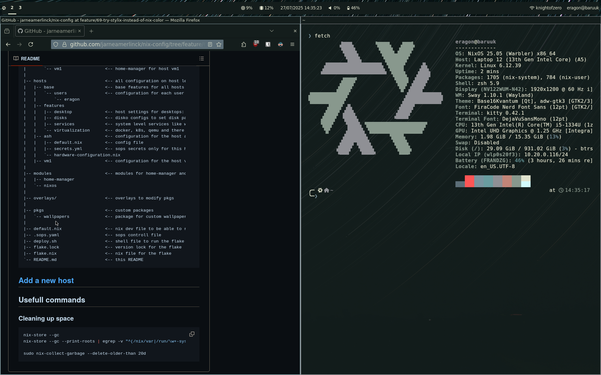

# nix configs

## Nixos Features

- [home manager](https://github.com/nix-community/home-manager) (to manage everything)
- [sops](https://github.com/Mic92/sops-nix) (secret managment + push to git)
- [disko](https://github.com/nix-community/disko/) (disk formatting)
- [stylix](https://github.com/nix-community/stylix) (for styles)
- [NUR](https://github.com/nix-community/NUR) (for firefox plugins)
- [nh](https://github.com/nix-community/nh) (better nixos rebuild output)

## Tooling


### CLI

- kitty
- neovim (from nixCats template see: [kickstart.nvim](https://github.com/jarneamerlinck/kickstart.nvim))
- fzf
- zoxide
- tmux
- btop/htop

### Desktop

- greetd
- sway + swaylock / swayidle
- waybar
- wofi
- stylix (or swww)

### Applications

- firefox (extentions, theme based on stylix, custom search engine, ml)
- feishin (desktop navidrome player)
- vesktop (discord with color themes and more)

## Rices

### Sway minimal




## Devices

| Hostname  | Board          | CPU                                                 |  RAM  | Primary GPU                                    | Secondary GPU | Role  |  OS   | State |
| :-------- | :------------- | :-------------------------------------------------- | :---: | :--------------------------------------------- | :------------ | :---: | :---: | :---: |
| `ash`     | Raspberry pi 4 | BCM2835 (4) @ 1.800GHz                              |  8GB  |                                                |               |   🖥️   |   ❄️   |   ✅   |
| `atlas`   | ZimaCube       | 12th Gen Intel(R) Core(TM) i5-1235U (12) @ 4.40 GHz |  64G  | Intel Iris Xe Graphics @ 1.20 GHz [Integrated] |               |   🖥️   |   ❄️   |   ✅   |
| `banshee` | Zimaboard 832  | Intel Celeron N3450 (4) @ 2.200GHz                  |  8GB  | Intel HD Graphics 500                          |               |   🖥️   |   ❄️   |   ✅   |
| `baruuk`  | Framework 12   | Intel Core - i5-1334U (10) @ 3.40GHz                | 16GB  | Intel Core - i5-1334U                          |               |   💻️   |   ❄️   |   ✅   |
|           |
| `vm1`     |                |                                                     |       |                                                |               |   📦   |   ❄️   |   ✅   |
| `testing` |                |                                                     |       |                                                |               |   📦   |   ❄️   |   ✅   |


Virtual machine: 📦
Linux: 🐧
NixOS: ❄️
Desktop: 🖥️
Laptop: 💻️

## Directory structure

```
|-- home                        <-- home-manager configuration for each user
|   `-- eragon                  <-- home-manager for user eragon
|       |-- base                <-- default configuration
|           `-- ssh.pub
|       |-- features
|       |   |-- cli             <-- configuration for all cli related tools
|       |   |-- desktop         <-- user configuration for desktop tools
|       |   |   |-- common
|       |   |   |-- gnome
|       |   |   |-- sway
|       |   `-- applications    <-- all user applications
|       |-- ash                 <-- home-manager for host ash
|       `-- vm1                 <-- home-manager for host vm1
|
|-- hosts                       <-- all configuration on host level
|   |-- base                    <-- base features for all hosts
|   |   `-- users               <-- configuration for each user (to call home-manager)
|   |       `-- eragon
|   |-- features
|   |   |-- desktop             <-- host settings for desktops: x11, wayland, pulsaudio, ...
|   |   |-- disks               <-- disko configs to set disk partitions on nix-anywhere install
|   |   |-- services            <-- system level services like wireguard or syncthing
|   |   `-- virtualization      <-- docker, k8s, qemu and there services/applications
|   |-- ash                     <-- configuration for the host ash
|   |   |-- default.nix         <-- config file
|   |   |-- secrets.yml         <-- sops secrets only for this host
|   |   `-- hardware-configuration.nix
|   |-- vm1                     <-- configuration for the host vm1
|
|-- modules                     <-- modules for home-manager and nixos
|   |-- home-manager
|   `-- nixos
|
|-- overlays/                   <-- overlays to modify pkgs
|
|-- pkgs                        <-- custom packages
|   `-- wallpapers              <-- package for custom wallpapers
|
|-- default.nix                 <-- nix dev file to be able to run the flake
|-- .sops.yaml                  <-- sops controll file
|-- deploy.sh                   <-- shell file to run the flake and update the system
|-- flake.lock                  <-- version lock for the flake
|-- flake.nix                   <-- nix file for the flake
`-- README.md                   <-- this README
```

## [Add a new host](./docs/host.md)

## Usefull commands

### Cleaning up space

```bash
nix-store --gc
nix-store --gc --print-roots | egrep -v "^(/nix/var|/run/\w+-system|\{memory|/proc)"

sudo nix-collect-garbage --delete-older-than 20d
```
